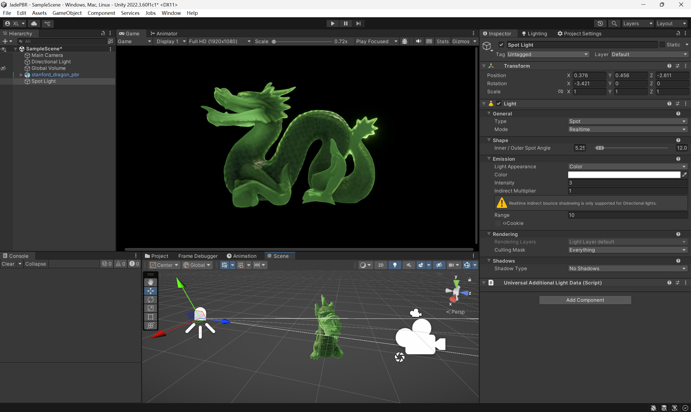

# Jade PBR Shader for Unity URP

一个为Unity Universal Render Pipeline (URP)设计的物理渲染(PBR)玉石着色器，实现了真实的玉石材质效果。



## ✨ 特性

### 🎨 完整的PBR渲染
- **Cook-Torrance BRDF模型**：业界标准的微表面BRDF
- **GGX法线分布函数**：真实的高光分布
- **Smith几何遮蔽**：准确的自遮蔽计算
- **Fresnel-Schlick反射**：物理准确的菲涅尔效果
- **能量守恒**：符合物理定律的光照计算

### 💎 玉石专属特性
- **次表面散射(SSS)**：基于半透明材质的背向散射模拟
- **简化透射模型**：模拟光线穿透薄区域的背光效果（非完整BTDF）
- **厚度贴图支持**：控制不同区域的透光程度和散射强度
- **内部辉光**：模拟玉石内部的荧光效果
- **深度颜色渐变**：根据厚度调整颜色深浅
- **菲涅尔边缘光**：物理准确的边缘发光效果

### ⚡ 完整的URP功能支持
- ✅ 主光源与附加光源
- ✅ 实时阴影（硬阴影/软阴影）
- ✅ 全局光照(GI)支持
- ✅ 光照贴图烘焙
- ✅ 球谐光照(SH)
- ✅ 雾效
- ✅ 深度预通道优化

## 📦 包含内容

### Shader文件
- **JadeBSSRDF.shader** - 原始版本，效果导向的玉石shader
- **JadeStandardPBR.shader** - 标准PBR版本，物理准确的渲染

### 两个版本的区别

| 特性 | JadeBSSRDF | JadeStandardPBR |
|-----|-----------|----------------|
| PBR模型 | 简化版 | 完整Cook-Torrance |
| 能量守恒 | 部分 | 完全符合 |
| GI支持 | 基础 | 完整支持 |
| 多光源 | 部分 | 完全支持 |
| 光照烘焙 | 无 | Meta Pass支持 |
| 物理准确性 | 中等 | 高 |
| 性能 | 较快 | 标准 |
| 适用场景 | 移动端/风格化 | PC/主机/写实 |

## 🚀 使用方法

### 1. 导入到Unity项目
将 `Assets/Jade` 文件夹复制到你的Unity项目中。

### 2. 创建材质
1. 在Project窗口右键 → Create → Material
2. 在Inspector中选择Shader：`URP/JadeStandardPBR` 或 `URP/JadeBSSRDF`

### 3. 配置材质参数

#### 基础属性
- **Albedo Map**: 基础颜色贴图
- **Base Color**: 整体色调（建议：淡绿色或白色）
- **Normal Map**: 法线贴图，增加表面细节
- **Normal Scale**: 法线强度 (0-2)

#### PBR贴图
- **Metallic(R) Smoothness(A)**: 金属度和光滑度贴图
  - 玉石建议：Metallic = 0, Smoothness = 0.8-0.95
- **Occlusion Map**: 环境遮蔽贴图
- **Thickness Map**: 厚度贴图
  - **白色** = 厚区域（较少透光）
  - **黑色** = 薄区域（更多透光）

#### 次表面散射参数
- **Subsurface Color**: 透射颜色（建议：淡绿色/黄绿色）
- **Scattering Power**: 散射锐度 (1-16)
- **Scattering Intensity**: 散射强度 (0-2)

#### 透射参数
- **Transmission Strength**: 透射强度 (0-1)
- **Transmission Distortion**: 透射扭曲 (0-0.5)
- **Shadow Fade**: 阴影对透射的影响 (0-1)

#### 玉石特效参数
- **Fresnel Power**: 菲涅尔强度 (1-8)
- **Rim Intensity**: 边缘光强度 (0-2)
- **Inner Glow**: 内部辉光 (0-1)
- **Depth Color**: 深层颜色
- **Depth Factor**: 深度影响系数 (0-2)

### 4. 推荐设置

#### 白玉
```
Base Color: (0.9, 0.9, 0.85)
Subsurface Color: (0.7, 0.8, 0.6)
Smoothness: 0.9
Thickness Scale: 1.0
Scattering Power: 6
```

#### 翡翠
```
Base Color: (0.6, 0.9, 0.7)
Subsurface Color: (0.4, 0.8, 0.5)
Smoothness: 0.85
Thickness Scale: 1.2
Scattering Power: 4
```

#### 和田玉
```
Base Color: (0.85, 0.88, 0.8)
Subsurface Color: (0.6, 0.75, 0.5)
Smoothness: 0.88
Thickness Scale: 1.5
Scattering Power: 5
```

## 🎯 性能优化建议

1. **移动平台**：使用 `JadeBSSRDF.shader`
2. **PC/主机**：使用 `JadeStandardPBR.shader`
3. **批处理**：相同材质的对象会自动批处理
4. **LOD**：为远距离对象使用简化shader或材质

## 📋 系统要求

- **Unity版本**: 2021.3 或更高
- **渲染管线**: Universal Render Pipeline (URP) 12.0+
- **平台**: 所有支持URP的平台
- **Shader Model**: 4.5+

## 🛠️ 技术细节

### 渲染技术说明

#### BRDF（双向反射分布函数）
- ✅ **完整实现** - 使用Cook-Torrance微表面模型
- GGX法线分布函数（NDF）
- Smith几何遮蔽函数
- Fresnel-Schlick菲涅尔项
- 完全符合物理能量守恒

#### BTDF（双向透射分布函数）
- ❌ **未完整实现** - 目前使用简化的透射模型
- 当前方案：基于视图方向的半球透射近似
- 适用于玉石等半透明材质的视觉效果
- 不是物理精确的体积散射BTDF

#### 次表面散射（SSS）
- ✅ **简化实现** - 适用于实时渲染
- 基于厚度图的背向散射
- 光线扭曲参数控制散射方向
- 考虑阴影对透射的影响

### Shader Passes
- **ForwardLit**: 主渲染Pass，包含所有光照计算
- **ShadowCaster**: 投射阴影
- **DepthOnly**: 深度预通道
- **Meta**: 光照贴图烘焙

### Shader变体
自动编译以下变体：
- 主光源阴影（级联/非级联）
- 软阴影
- 附加光源（顶点/像素）
- 附加光源阴影
- 光照贴图
- 定向光照贴图
- 雾效

## 🔧 故障排除

### 材质看起来太暗
- 增加 `Base Color` 的亮度
- 检查场景光照设置
- 确保有Global Illumination

### 背面太亮
- 减少 `Transmission Strength`
- 减少 `Scattering Intensity`
- 调整 `Thickness Map`

### 没有透光效果
- 确保 `Thickness Scale` > 0
- 检查 `Thickness Map` (黑色=薄=透光)
- 确保光源在背面

### 边缘过亮
- 减少 `Rim Intensity`
- 调整 `Fresnel Power`
- 降低 `Subsurface Color` 的亮度

## 📝 更新日志

### Version 1.0 (2025-10-27)
- ✅ 完整的PBR实现
- ✅ 次表面散射系统
- ✅ 透射效果
- ✅ 厚度贴图支持
- ✅ 完整的URP功能支持
- ✅ 两个版本：标准PBR和优化版

## 📄 许可证

本项目采用 MIT 许可证。你可以自由使用、修改和分发。

## 🤝 贡献

欢迎提交Issue和Pull Request！

## 📧 联系方式

如有问题或建议，请通过GitHub Issues联系。

---

**注意**: 此shader专为URP设计，不兼容Built-in Render Pipeline或HDRP。
